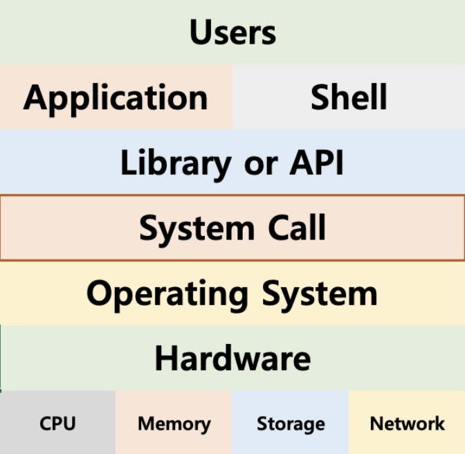

# Chapter02 운영체제 구조

## 운영체제는 사용자 인터페이스 제공
- 쉘(Shell)
  - 사용자가 운영체제 기능과 서비스를 조작할 수 있도록 인터페이스를 제공하는 프로그램
  - 쉘은 터미널 환경(CLI)과 GUI환경 두 종류로 분류

## 운영체제는 응용 프로그램을 위해서도 인터페이스를 제공
- API(Application Programming Interface)
- API는 요청서(함수)의 집합이다.
- 라이브러리(library) 형태로 제공

### 시스템콜
- 시스템 콜 또는 시스템 호출 인터페이스
- 운영체제가 운영체제 각 기능을 사용할 수 있도록 시스템콜이라는 명령 또는 함수를 제공
- API 내부에서는 시스템콜을 호출하는 형태로 만들어지는 경우가 대부분

## 운영체제를 만든다면?
1. 운영체제를 개발한다. (kernel)
2. 시스템 콜을 개발
3. C API (library) - 사용하는 언어에 따라
4. Shell 프로그램
5. 응용 프로그램 개발

## 운영체제와 시스템콜
- 시스템콜 정의 예 : POSIX API, 윈도우 API

> API : 각 언어별 운영체제 기능 호출 인터페이스 함수  
> 시스템콜 : 운영체제 기능을 호출하는 함수

## 정리
- 운영체제는 컴퓨터 하드웨어와 응용 프로그램을 관리한다.
- 사용자 인터페이스를 제공하기 위해 쉘 프로그램을 제공한다.
- 응용 프로그램이 운영체제 기능을 요청하기 위해서, 운영체제는 시스템 콜을 제공한다.
- 보통 시스템 콜을 직접 사용하기 보다는 , 해당 시스템 콜을 사용해서 만든 각 언어별 라이브러리(API)를 사용한다.

## CPU Protection Rings
- CPU 권한 모드
  - 사용자 모드 (user mode): 응용 프로그램이 사용
  - 커널 모드 (kernel mode): OS가 사용

## 시스템 콜은 커널 모드로 실행
- 커널 모드에서만 실행 가능한 기능들이 있음
- 커널 모드로 실행하려면, 반드시 시스템 콜을 거쳐야 함
- 시스템 콜은 운영체제가 제공

## 사용자 모드와 커널 모드
- 함부로 응용 프로그램이 전체 컴퓨터 시스템을 헤치지 못함

## 정리
- 운영체제는 **시스템 콜** 제공
- 프로그래밍 언어별로 운영체제 기능을 활용하기 위해 시스템 콜을 기반으로 **API**제공
- 응용 프로그램은 운영체제 기능 필요시 해당 **API**를 사용해서 프로그램을 작성
- 응용 프로그램이 실행되서 운영체제 기능이 필요한 **API**를 호출하면 시스템 콜이 호출되서 **커널 모드로 변경되어** OS 내부에서 해당 명령이 실행되고 다시 응용 프로그램으로 돌아간다.

